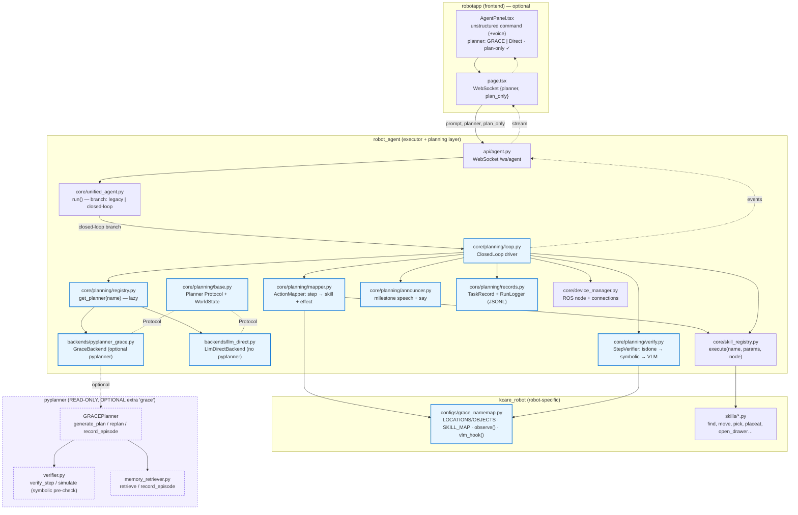

# Closed-loop architecture — NL → plan → exec → check → replan

Detailed architecture for wiring a **planner** (GRACE/pyplanner, or a direct-LLM
fallback) into **kcare_robot / robot_agent** (the real executor) as a closed
loop, alongside the legacy open-loop `UnifiedAgent.run`.

> **Status: SHIPPED.** This describes the as-built system. The closed-loop
> driver, a planner-agnostic abstraction, two backends, the per-step verifier,
> the announcer, run logging, and the user-facing planner / plan-only controls
> are implemented. Remaining stubs are called out inline (e.g. the real
> grounding pass in `grace_namemap.observe()` and the true VLM frame check in
> `grace_namemap.vlm_hook()`).

Companion docs: [`SKILLS.md`](SKILLS.md) · [`ACTION_MAPPER_SPEC.md`](ACTION_MAPPER_SPEC.md) · [`TRACKING_VERIFY_VOICE.md`](TRACKING_VERIFY_VOICE.md).

> **Constraint:** `pyplanner/` and `paper_grace/` are consumed **read-only** as a
> library — no edits there. `robot_agent` stays **decoupled from GRACE** behind a
> `Planner` Protocol (`core/planning/base.py`); GRACE is reached only through the
> `pyplanner_grace` backend, and `pyplanner` is an **optional extra** (`grace`),
> imported lazily. All glue code is robot-side (`robot_agent/`, `kcare_robot/`).

---

## 1. Layer / ownership architecture



Blue = shipped robot-side code. Purple/dashed = pyplanner, read-only and
optional (only `GraceBackend` ever imports it, lazily).

### The planner abstraction (decoupling)

- **`base.py`** — `Planner` is a `runtime_checkable typing.Protocol` with
  `generate_plan(task, obs, visible_objects) -> (steps, metrics)` and
  `replan(task, completed, failed_step, failure_reason, obs, visible_objects)
  -> (steps, metrics)`. It deliberately does **not** import `pyplanner`. It also
  defines `WorldState`, the self-contained symbolic state the mapper maintains
  (mirrors `pyplanner.verifier.SymbolicState`, but with no `pyplanner` import).
- **`registry.py`** — `get_planner(name, **cfg)` constructs a backend by name.
  Backends are imported **lazily inside the function** so importing the planning
  package never pulls in `pyplanner` or other heavy deps. Known names:
  `"grace"` → `backends.pyplanner_grace.GraceBackend`, `"llm_direct"` →
  `backends.llm_direct.LlmDirectBackend`. Unknown names raise `ValueError`
  listing the available backends.
- **`backends/pyplanner_grace.py`** — `GraceBackend` adapts pyplanner's GRACE
  planner. `import pyplanner` happens **inside `__init__`**; if pyplanner is
  absent it raises a clear `RuntimeError("pip install -e pyplanner ...")`. It
  filters kwargs to those `pyplanner.get("GRACE", …)` accepts, coerces the
  returned `PlanMetrics` to a plain dict, and exposes an optional
  `record_episode`.
- **`backends/llm_direct.py`** — `LlmDirectBackend` reproduces the legacy
  open-loop planning flow (`init_llm_client` → structured/freeform guide →
  `recontruct_plan` → parse `action::inputs && …` into PlanStep dicts) behind
  the same Protocol. `obs`/`visible_objects` are accepted but unused. It has no
  true suffix replan: `replan` re-runs a full `generate_plan` with the failure
  context appended to the task. `pyconnect` imports are lazy.
- **Optional extra.** `robot_agent/pyproject.toml` declares
  `[project.optional-dependencies] grace = ["pyplanner"]`. The core install does
  **not** depend on pyplanner; use `pip install -e ".[grace]"` (and
  `pip install -e ../pyplanner`) to enable the GRACE backend.

---

## 2. Closed-loop sequence (one command, with a failure + replan)

```mermaid
sequenceDiagram
  participant U as User (NL, vi/en)
  participant UA as UnifiedAgent.run
  participant CL as ClosedLoop ★
  participant NM as grace_namemap.observe()
  participant REG as get_planner()
  participant PL as Planner backend (grace | llm_direct)
  participant AM as ActionMapper ★
  participant VER as StepVerifier ★
  participant SR as SkillRegistry → skill
  participant ANN as Announcer ★
  participant MEM as planner.record_episode

  U->>UA: prompt {planner, plan_only}
  UA->>UA: translate (if lang≠en)
  UA->>CL: ClosedLoop(self, planner=…).run_blocking(task, lang, plan_only)
  CL->>NM: observe(node)
  NM-->>CL: (obs, visible_objects)
  CL->>REG: get_planner(planner, host/model/live_path…)
  REG-->>CL: backend
  CL->>PL: generate_plan(task, obs, visible)
  PL-->>CL: steps[], meta
  CL->>AM: screen(steps)
  AM-->>CL: warnings (unsupported actions) → emit
  CL-->>UA: ev "plan" (steps, plan_meta, warnings)

  alt plan_only
    CL-->>UA: ev "done" status="planned" (no execution) → return
  else execute
    loop each step
      CL->>AM: to_skill(step, world)
      alt Unmappable
        AM-->>CL: raise → step_done failed → replan?
      else no-op (Sit/Wait/…)
        AM-->>CL: None → step_done success
      else mappable
        AM-->>CL: (skill, params); +namemap.build_params
        CL->>SR: execute(skill, params, node)
        CL->>VER: verify(step, result, world, node)
        Note over VER: layer 1 isdone → layer 2 symbolic<br/>→ layer 3 VLM (vlm_hook, if enabled)
        alt verdict ok
          VER-->>CL: ok
          CL->>AM: apply_effect(step, world)
          CL->>ANN: step_success → say + speaker
        else verdict fail
          VER-->>CL: (False, reason)
          CL->>NM: observe(node)  (fresh obs)
          CL->>PL: replan(task, completed, failed_step, reason, obs', visible')
          PL-->>CL: suffix[] → splice after completed prefix
          Note over CL: stop if replans ≥ max_replans → status failed
        end
      end
    end
    CL->>MEM: record_episode(task, completed)  %% on full success, best-effort
    CL-->>UA: ev "done" status=success|failed
  end
  UA-->>U: WebSocket events (+ say milestones)
```

**Layered checking** (`verify.py`, the core idea):
- **Layer 1 — isdone**: the skill's own `{isdone, msg}` (the physical ground
  truth, e.g. `grasp_succeed`, retry loops).
- **Layer 2 — symbolic**: the step's expected effect on `WorldState`.
- **Layer 3 — VLM**: optional, only for `nm.VLM_ACTIONS`, dispatched through
  `nm.vlm_hook`. Off by default (gated by `ROBOT_AGENT_VERIFY_VLM=1`).

`verdict(results)` folds the layer results into `(ok, reason)`; a failing
`reason` becomes the planner's `failure_reason` on replan.

---

## 3. Per-step data / state flow

```
GRACE step {action, object, target?}
        │
        ▼
ActionMapper.to_skill(step, world)            # core/planning/mapper.py
        │   ├─ NameMap: CamelCase → robot name   (Kitchen→kitchen, CoffeeMachine→"coffee machine")
        │   ├─ SKILL_MAP: action → kcare skill    (MoveTo→move, Pick→pick, …)
        │   ├─ NOOP_ACTIONS → None (Sit/Wait/…)   → marked success, no skill call
        │   ├─ inject object from world.found for Pick
        │   └─ Unmappable(reason) → step_done failed → replan / operator
        ▼
namemap.build_params(action, obj, world)      # optional extra per-skill params
        ▼
(skill_name, params) ─► SkillRegistry.execute(skill, params, node) ─► {isdone, msg, …}
        │                                                                  │
        ▼                                                                  ▼
StepVerifier.verify(step, result, world, node) ──► [VerifyResult …] ──► verdict → (ok, reason)
        │
   ok? ─ yes ─► ActionMapper.apply_effect(step, world)   # mirror verifier._apply
        │            arrived/found/holding/opened/on ← updated
        └─ no ──► observe(node) (fresh obs) → planner.replan(task, completed,
                       failed_step, reason, obs', visible')  → splice suffix
```

State object = `core/planning/base.py::WorldState` — a self-contained dataclass
(`arrived`, `found`, `holding`, `opened`, `on`, plus `holding_since` and
`found_pose`) with `copy()` / `as_text()` / `to_dict()` / `update_from_dict()` /
`found_pose_is_stale()`. It mirrors `pyplanner.verifier.SymbolicState` semantics
but is **not** imported from pyplanner.

It is **persistent**: it lives on `AgentState.world` (one per process, not a
per-run local), so a plan sees what the previous one left behind, and it is
saved to `common_dir/world_state.json` (`save_world`/`load_world`) to survive a
restart. Two things feed it each run:

- **Sensor reconcile** — at the **start** of `run_blocking`, `reconcile_world(node,
  world)` refreshes `arrived` from the localizer (nearest ENV `loc`), then
  `world.as_text()` is appended to the planner `obs` so the planner knows the
  current holding/location. Robot-overridable via the namemap hooks
  `reconcile_world` / `robot_xy` (else a generic `mobile_pose` + ENV fallback).
- **`apply_effect`** — after each verified step (and `holding_since` stamping on
  Pick/Place); the world is `save_world()`-persisted after each effect.

Only `arrived` is sensor-derived; `found`/`holding`/`opened`/`on`/`found_pose`
are beliefs (no gripper sensor). `found_pose` is base-frame at detection and goes
stale once the base moves (display-only). The live world is also streamed to the
dashboard — see `TRACKING_VERIFY_VOICE.md` §5.

---

## 4. Files changed (shipped)

### ★ NEW — `robot_agent` planning layer (`robot_agent/robot_agent/core/planning/`)

| File | Purpose |
|---|---|
| `base.py` | `Planner` Protocol + `WorldState` dataclass + `PlanStep` alias. No `pyplanner` import. |
| `registry.py` | `get_planner(name, **cfg)` — lazy backend dispatch; keeps the planning package import-clean. |
| `backends/pyplanner_grace.py` | `GraceBackend` — adapts pyplanner's GRACE; lazy `import pyplanner`, kwarg filtering, metrics→dict, optional `record_episode`. |
| `backends/llm_direct.py` | `LlmDirectBackend` — legacy direct-LLM flow behind the Protocol; lazy `pyconnect`; naive full re-plan on `replan`. |
| `loop.py` | `ClosedLoop` — the driver: ground → generate_plan → screen → map → exec → check → replan → record, streaming events; `run_blocking(task, lang, plan_only)`. |
| `mapper.py` | `ActionMapper` (`to_skill`, `apply_effect`, `screen`) + `Unmappable`. Robot-agnostic; pulls specifics from the NameMap. |
| `verify.py` | `StepVerifier` (isdone → symbolic → VLM) + `VerifyResult` + `verdict()`. |
| `announcer.py` | `Announcer` — localized milestone phrases (robot speaker + `say` for the dashboard). |
| `records.py` | `TaskRecord` / `StepRecord` / `VerifyResult` / `RunLogger` (per-run JSONL) + `new_task_record`. |

### ★ NEW — `kcare_robot` robot-specific config

| File | Purpose |
|---|---|
| `kcare_robot/kcare_robot/configs/grace_namemap.py` | `LOCATIONS`/`OBJECTS` maps; `to_loc`/`to_obj`; `SKILL_MAP`; `SUPPORTED_ACTIONS`/`NOOP_ACTIONS`/`VLM_ACTIONS`; `build_params`; `observe(node)` grounding hook; `vlm_hook(step, node)` Layer-3 verifier. **Partly stubbed — see §8.** |

### ✎ MODIFIED

| File | Change |
|---|---|
| `robot_agent/robot_agent/core/unified_agent.py` | `run()` gained `planner` / `plan_only` params; after translate, a **closed-loop branch** delegates to `ClosedLoop(self, planner=…).run_blocking(prompt_en, lang, plan_only=…)`. Legacy open-loop path is unchanged below it (fallback). |
| `robot_agent/robot_agent/api/agent.py` | `/ws/agent` reads `planner` and `plan_only` from the inbound JSON and forwards them to `ua.run(...)`. |
| `robot_agent/pyproject.toml` | Added `[project.optional-dependencies] grace = ["pyplanner"]`. **pyplanner is NOT a core dependency.** |
| `robotapp/frontend/components/AgentPanel.tsx` | Unstructured mode gained a **planner selector** (`GRACE` \| `Direct`, default `grace`) and a **"plan only" checkbox** (default checked); both persisted to `localStorage`. |
| `robotapp/frontend/app/page.tsx` | `run()` takes `planner`/`planOnly`, sends them over the WebSocket as `{planner, plan_only}`; speaks each event's `say` via `useVoiceOutput`. |

### ✗ UNTOUCHED (by constraint / design)

| Path | Why |
|---|---|
| `pyplanner/**` | Consumed as an optional library via public API only. |
| `paper_grace/**` | Research repo, read-only. |
| `kcare_robot/kcare_robot/skills/*.py` | Mapper / hooks call **existing** skills (`find`, `grasp_succeed`, `llm`, …); only a config file was added. |
| `robot_agent/.../skill_registry.py`, `device_manager.py` | Reused as-is. |

---

## 5. Integration point (exact)

`UnifiedAgent.run` ([unified_agent.py](../../robot_agent/robot_agent/core/unified_agent.py)) now branches inside `_blocking()`, right after the translate block:

```python
# api maps UI 'direct' → backend 'llm_direct'; 'grace' stays 'grace'.
_planner = {'grace': 'grace', 'direct': 'llm_direct'}.get(planner) if planner else None
if (_planner is not None or plan_only
        or _os.environ.get('ROBOT_AGENT_CLOSED_LOOP') == '1'):
    from .planning.loop import ClosedLoop
    _kw = {'planner': _planner} if _planner else {}
    for _ev in ClosedLoop(self, **_kw).run_blocking(prompt_en, lang, plan_only=plan_only):
        emit(_ev)
    return
# else: existing open-loop path stays exactly as-is (fallback)
```

So the closed loop is activated by **any** of: an explicit UI planner choice, a
`plan_only` request, or the `ROBOT_AGENT_CLOSED_LOOP=1` env gate.
`ClosedLoop.__init__` pulls `skill_registry`, `device_manager` and `_llm_cfg`
off the agent, resolves the robot package from `state.current()`, imports
`<robot_pkg>.configs.grace_namemap`, and resolves config (§6). The WebSocket
event stream (`task_start`, `status`, `plan`, `warning`, `step_start`,
`step_verify`, `step_done`, `replan`, `done`, plus `say`) is serialized by
`api/agent.py` exactly like the legacy events.

---

## 6. Config & flags

`ClosedLoop._resolve_cfg` reads explicit `**overrides` first, then env vars,
then `_llm_cfg`, then defaults under `state.common_dir`:

| Key | Source | Default |
|---|---|---|
| `planner` | UI `{planner}` (`grace`/`direct`→`llm_direct`) or `ROBOT_AGENT_PLANNER` | `grace` |
| `vlm_enabled` | `ROBOT_AGENT_VERIFY_VLM` (`"1"` → on) | `False` |
| `speak_backend` | `ROBOT_AGENT_VOICE_BACKEND` (`"0"` → off) | on |
| `mute_skill_tts` | override | `True` (plan-level announcer owns milestone speech) |
| `max_replans` | `ROBOT_AGENT_MAX_REPLANS` | `3` |
| `host` / `model` | `_llm_cfg["url"\|"host"]` / `_llm_cfg["model"]` | from llm_cfg |
| `log_dir` | override | `<common_dir>/task_runs` (per-run JSONL) |
| `live_path` | override | `<common_dir>/grace_memory.jsonl` (GRACE `record_episode`, robot-side) |

For the GRACE backend, `ClosedLoop._make_planner` calls
`get_planner("grace", host=…, model=…, live_path=…, safe_refine=True)`; for the
direct backend it calls
`get_planner("llm_direct", llm_cfg=self._llm_cfg, robot_pkg=self.robot_pkg)`.

---

## 7. User-facing controls → backend (trace)

The two NEW controls live in the **unstructured** tab of `AgentPanel.tsx`:

1. **Planner method** — `<select>` `GRACE` | `Direct`, state `planner`
   (`PlannerMethod = 'grace' | 'direct'`), **default `grace`**, persisted under
   `robotapp_planner`.
2. **Plan only** — checkbox, state `planOnly`, **default checked** (`po === null
   ? true : po === '1'`), persisted under `robotapp_plan_only`.

Flow:

```
AgentPanel.run()
  └─ onRun(prompt, /*direct=*/false, lang, planner, planOnly)
        ▼
page.tsx run(finalPrompt, direct, lang, planner='grace', planOnly=false)
  └─ ws.send({ prompt, lang, direct, planner, plan_only: planOnly })
        ▼
api/agent.py  agent_ws()
  └─ planner = data.get('planner'); plan_only = data.get('plan_only', False)
  └─ ua.run(prompt, lang, planner=planner, plan_only=plan_only)
        ▼
unified_agent.py run()
  └─ map 'direct'→'llm_direct'; closed-loop branch (see §5)
  └─ ClosedLoop(self, planner=…).run_blocking(prompt_en, lang, plan_only=…)
        ▼
loop.py run_blocking(task, lang, plan_only)
  └─ ground → generate_plan → screen → emit "plan"
  └─ if plan_only:                              # EARLY RETURN
         run.status = "planned"
         emit "done"  status="planned"  say=announce("plan_ready")
         return        # no map / exec / verify / replan
```

So "plan only" surfaces the generated plan (with screen warnings) to
`PlanPanel` and stops before touching the robot — the safe default for an
operator reviewing what the planner intends to do.

> Note: the **structured** tab does not use the planner/plan-only controls; it
> calls `onRun(cell, /*direct=*/true, lang)` and runs `UnifiedAgent.run_direct`
> (no LLM, no closed loop).

---

## 8. Robot-side stubs (implemented vs TODO)

In `kcare_robot/configs/grace_namemap.py`:

| Hook | Status |
|---|---|
| `to_loc` / `to_obj` / `SKILL_MAP` / `SUPPORTED_ACTIONS` / `NOOP_ACTIONS` / `VLM_ACTIONS` / `build_params` | **Implemented.** Maps GRACE vocabulary ↔ kcare names/skills. `VLM_ACTIONS = {Pick, Place, PutIn, Open, Close}`. `TODO(integrator)`: fill/trim the maps from the deployed site's ENV config. |
| `observe(node)` | **Stub (safe default).** Returns `("", [])`. A real grounding pass (head-camera open-vocab detect through the `find`/`detect` skill → human-readable obs + labels) is sketched but **disabled by default**, because a meaningful query needs a candidate set and `find()` moves the head as a side effect. `generate_plan` therefore currently plans from the NL task alone. |
| `vlm_hook(step, node)` | **Partly implemented.** `Pick` → real depth-based `grasp_succeed` check (kcare's authoritative in-hand check). Other `VLM_ACTIONS` → **text-LLM yes/no heuristic** via the `llm` skill (skipped permissively if no LLM client). The true *vision*-language check (grab a head/arm frame, send to a VLM) is `TODO(integrator)` — the current `llm` skill is text-only. Guarded end-to-end: never raises; permissive on failure. Only invoked when `ROBOT_AGENT_VERIFY_VLM=1`. |

---

## 9. Rollout phases ↔ status

1. **Planner abstraction** — `base.py` Protocol + `WorldState`, `registry.py`,
   `pyplanner_grace`/`llm_direct` backends, optional `grace` extra. **Done.**
2. **Driver + mapper + screen** — `loop.py`, `mapper.py` (`screen` warnings).
   **Done.**
3. **Verify + voice + logging** — `verify.py` (layered), `announcer.py`,
   `records.py`/`RunLogger`. **Done.**
4. **Close the loop** — bounded `replan()` with suffix splicing
   (`_maybe_replan`, `max_replans`). **Done.**
5. **Grounding + true VLM** — real `observe()` and a vision `vlm_hook`.
   **TODO (stubs in place; §8).**
6. **Memory + eval** — `record_episode` to `live_path` on success. **Done**
   (best-effort); on-robot eval via the paper_grace harness (read-only)
   remains optional.

The legacy open-loop path stays the default fallback whenever no planner /
`plan_only` is requested and `ROBOT_AGENT_CLOSED_LOOP` is unset.
